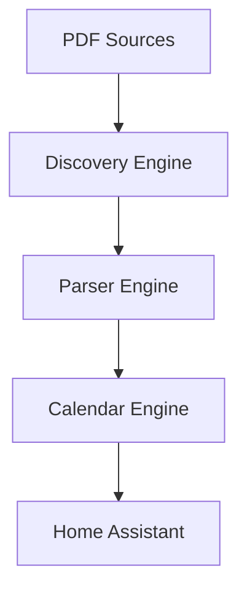
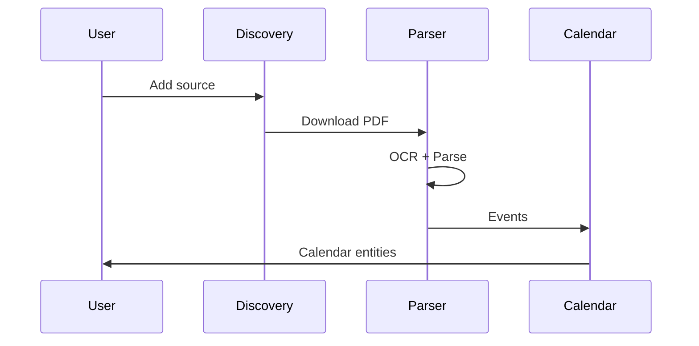

# Architecture

```mermaid
graph TD
A[PDF Sources]-->B[Discovery Engine]
B-->C[Parser Engine]
C-->D[Calendar Engine]
D-->E[Home Assistant]
```

## Sequence

```mermaid
sequenceDiagram
participant U as User
participant D as Discovery
participant P as Parser
participant C as Calendar
U->>D: Add source
D->>P: Download PDF
P->>P: OCR + Parse
P->>C: Events
C->>U: Calendar entities
```